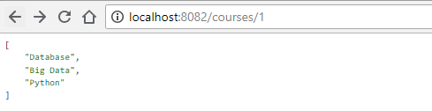
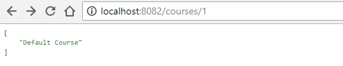
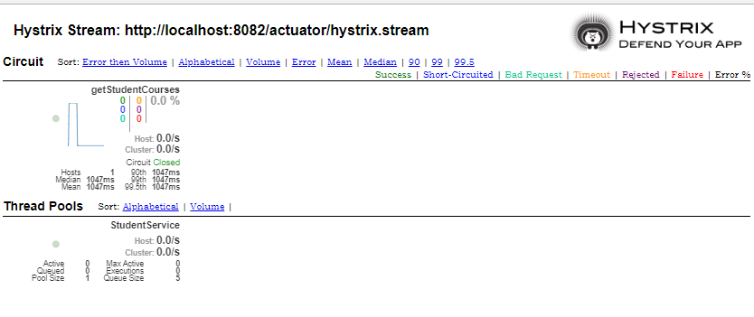

# spring-boot-hystrix-example
Spring Boot integrate with Hystrix Example Project

## How to Run

The **CourseService Application** runs on `localhost:8081`, it provides a single rest api:
+ `/selectedCourses/{studentId}` - returns a list of course name.

The **StudentService Application** runs on `localhost:8082`, it consumes Course Service and provides its own api:
+ `/courses/{id}`, returns a student's selected courses by student id
    - if the Course Service is down or error occurs, it will calls a fallback method and returns a default value "Default Course".

:point_down: *Success Result*

:point_down: *Fallback Result:*

This use scenario seems meaningless, but since we just want to use it to demo how to integrate Hystrix and Hystrix dashboard with Spring-Boot.
So please do not care much about this. :stuck_out_tongue_closed_eyes:

After you start the two services, you could open Hystrix Dashboard on `http://localhost:8082/hystrix`, and set the following url into the input
`http://localhost:8082/actuator/hystrix.stream` and monitor it.

:point_down: *Hystrix Dashboard*

Have Fun! :wink:

